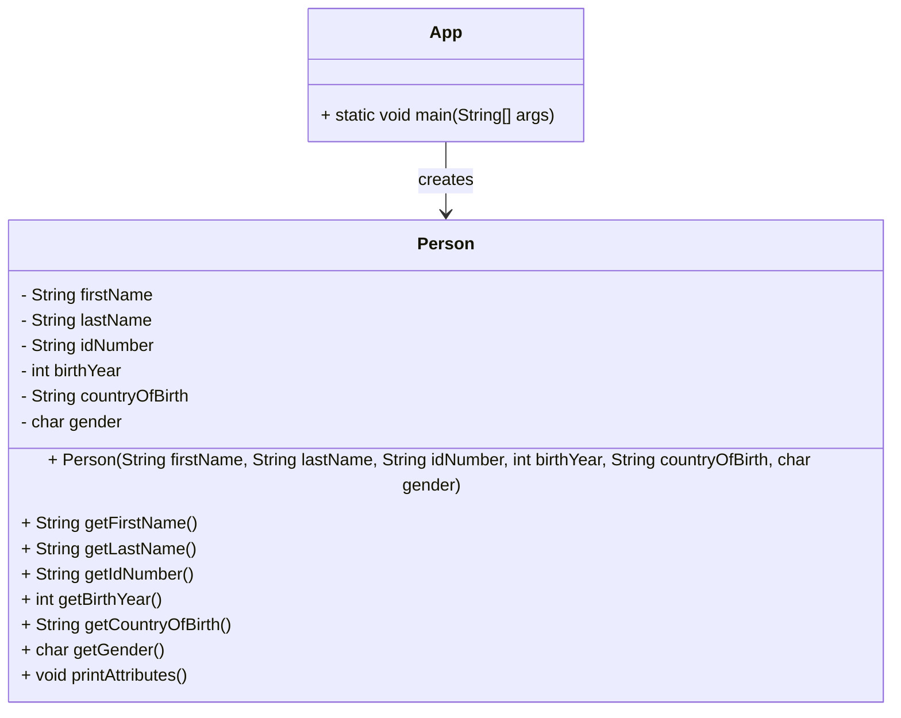

my-first-java-class66

```mermaid
classDiagram
    class Person {
        - String firstName
        - String lastName
        - String idNumber
        - int birthYear
        - String countryOfBirth
        - char gender
        + Person(String firstName, String lastName, String idNumber, int birthYear, String countryOfBirth, char gender)
        + String getFirstName()
        + String getLastName()
        + String getIdNumber()
        + int getBirthYear()
        + String getCountryOfBirth()
        + char getGender()
        + void printAttributes()
    }

    class App {
        + static void main(String[] args)
    }

    App --> Person : creates
```
