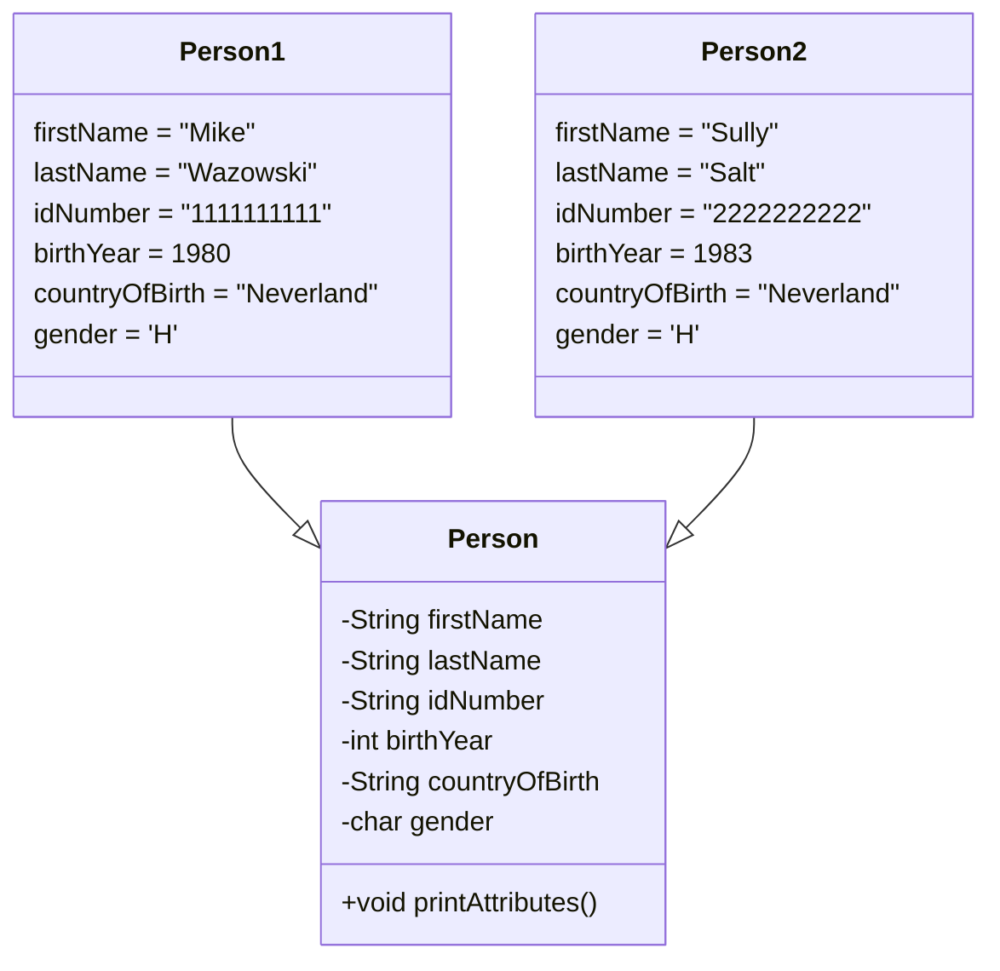

my-first-java-class66

```mermaid
classDiagram
    class Person {
        -String firstName
        -String lastName
        -String idNumber
        -int birthYear
        -String countryOfBirth
        -char gender
        +void printAttributes()
    }

    %% Define instances as separate classes for the diagram visualization
    class Person1 {
        firstName = "Mike"
        lastName = "Wazowski"
        idNumber = "1111111111"
        birthYear = 1980
        countryOfBirth = "Neverland"
        gender = 'H'
    }

    class Person2 {
        firstName = "Sully"
        lastName = "Salt"
        idNumber = "2222222222"
        birthYear = 1983
        countryOfBirth = "Neverland"
        gender = 'H'
    }

    Person1 --|> Person
    Person2 --|> Person

```
